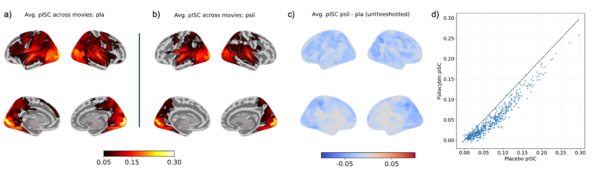
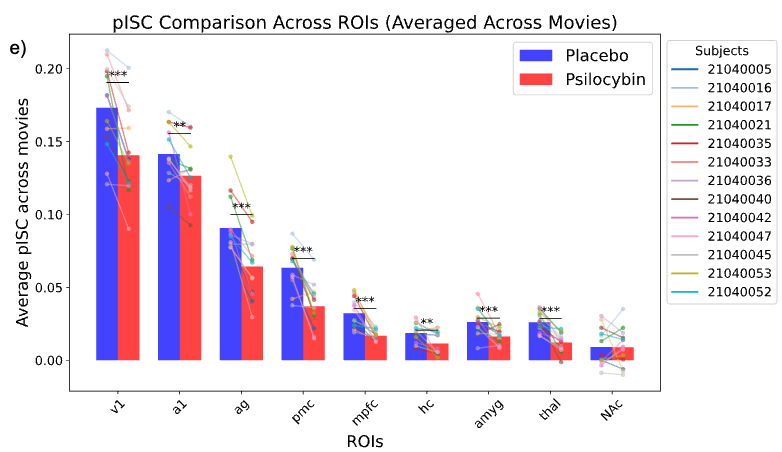

Here’s a figure:

Figure 1— Psilocybin reduces intersubject pattern correlation (pISC) across cortex
For each drug condition, pISC was calculated on 450 brain parcels. a) and b) pISC maps for placebo and psilocybin conditions, respectively (threshold r=0.05). c) and d) psilocybin minus placebo pISC difference map thresholded at 0.05 difference and unthresholded, respectively. e) kernel density estimation (KDE) representing the number of parcels at varying pISC. f) repeated measures t-test comparing pISC at a-priori bilateral ROIs: V1, A1, angular gyrus, posterior medial cortex, medial prefrontal cortex, hippocampus, amygdala, thalamus, and nucleus accumbens. pISC was significantly lower in all ROIs except NAc, indicating that psilocybin increased idiosyncrasy of brain response patterns during naturalistic perception across the cortical hierarchy.
