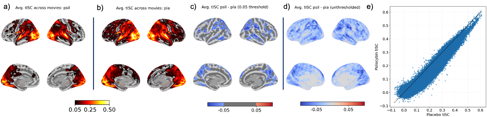
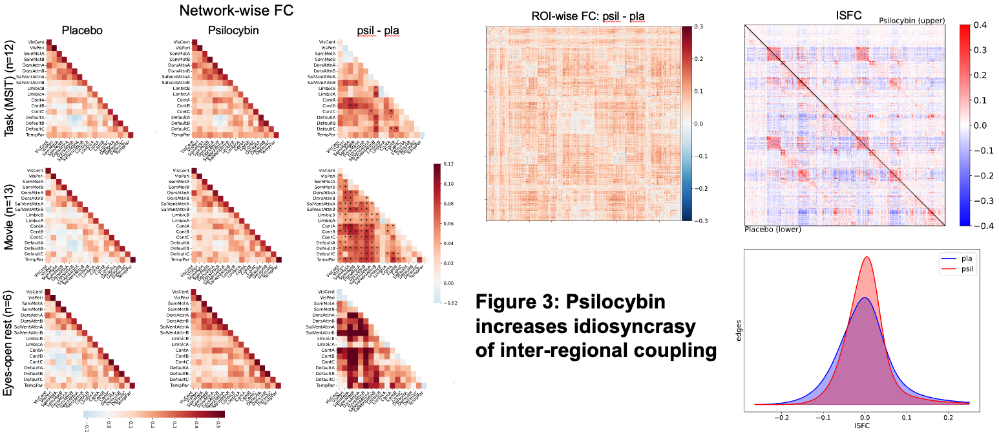

**Figure 1— Psilocybin reduces intersubject pattern correlation (pISC) across cortex**
For each drug condition, pISC was calculated on 450 brain parcels. **a) and b)** pISC maps for placebo and psilocybin conditions, respectively (threshold r=0.05). **c) and d)** psilocybin minus placebo pISC difference map thresholded at 0.05 difference and unthresholded, respectively. **e)** kernel density estimation (KDE) representing the number of parcels at varying pISC. **f)** repeated measures t-test comparing pISC at a-priori bilateral ROIs: V1, A1, angular gyrus, posterior medial cortex, medial prefrontal cortex, hippocampus, amygdala, thalamus, and nucleus accumbens. **pISC was significantly lower in all ROIs except NAc, indicating that psilocybin increased idiosyncrasy of brain response patterns during naturalistic perception across the cortical hierarchy.**

**Figure 2: Psilocybin reduces temporal intersubject correlation (tISC) across cortex**
For each drug condition, tISC was calculated on each voxel. **a) and b)** tISC maps for placebo and psilocybin conditions, respectively (threshold r=0.1). **c) and d)** psilocybin minus placebo tISC difference map thresholded at 0.05 difference and unthresholded, respectively. **e)** KDE representing the number of voxels at varying tISC.

**Figure 3: Psilocybin increases idiosyncrasy of inter-regional coupling**
For each drug condition, ISFC was calculated between 450x450 parcel edges. **c)** ISFC from placebo and psilocybin conditions plotted in lower and upper triangles, respectively. **d)** KDE representing number of edges at varying ISFC. a) within- and between-network FC under effects of placebo (left column), psilocybin (middle), and difference (right) during task (top row), movie watching (middle), and eyes-open rest (bottom). **b)** 450x450 parcel-wise FC difference matrix  Psilocybin caused both negative and positive ISFC edges to become uncorrelated, indicating that inter-regional coupling (and anti-coupling) was more idiosyncratic on psilocybin(?). Psilocybin increased FC between most edges. Edges where FC increased but ISFC decreased may represent consistent drug-induced changes uncoupled from the stimulus. 
