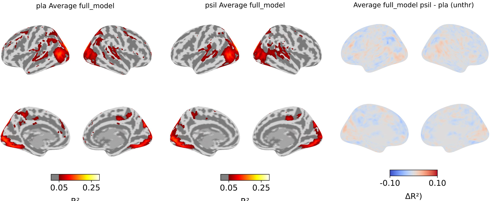

**Figure 1— Psilocybin reduces intersubject pattern correlation (pISC) across cortex**
For each drug condition, leave-one-out pISC was calculated on 450 brain parcels during passive movie viewing and averaged across movies. a) and b) pISC maps for placebo and psilocybin conditions, respectively, thresholded r=0.05. c) unthresholded psilocybin minus placebo pISC difference map. d) scatterplot with each point representing one parcel and its pISC in the placebo and psilocybin conditions. Dotted line represents equal pISC across both drug conditions. e) repeated measures t-test comparing pISC at a-priori bilateral ROIs: V1, A1, angular gyrus, posterior medial cortex, medial prefrontal cortex, hippocampus, amygdala, thalamus, and nucleus accumbens. **pISC was significantly lower in all ROIs except NAc, indicating that psilocybin increased idiosyncrasy of brain response patterns during naturalistic perception across the cortical hierarchy.**

**Figure 2: Psilocybin reduces temporal intersubject correlation (tISC) across cortex**
For each drug condition, leave-one-out tISC was calculated on each voxel during passive movie viewing and averaged across movies. a) and b) tISC maps for placebo and psilocybin conditions, respectively, thresholded at r=0.05. c) and d) psilocybin minus placebo tISC difference map thresholded at 0.05 difference and unthresholded, respectively. e) scatterplot with each point representing one parcel and its tISC in the placebo and psilocybin conditions. Dotted line represents equal tISC across both drug conditions.

**Figure 3: Psilocybin increases idiosyncrasy of inter-regional coupling (forgot to put letters on the poster — my bad)**
a) within- and between-network FC under effects of placebo (left column), psilocybin (middle), and difference (right) during multisource inference (cognitive control) task (top row), passive movie viewing (middle), and eyes-open rest (bottom).  b) 450x450 parcel-wise FC difference matrix during movie watching (psilocybin minus placebo). c) ISFC (intersubject functional connectivity) from placebo and psilocybin conditions plotted in lower and upper triangles, respectively. d) kernel density estimation representing number of edges at varying ISFC.  Psilocybin caused both negative and positive ISFC edges to become uncorrelated, indicating that inter-regional coupling (and anti-coupling) was more idiosyncratic on psilocybin. Psilocybin increased FC between most edges, suggesting psilocybin causes spatially widespread effects on brain activity that are consistent across subjects but unrelated to the stimulus. 

**Figure 4: Low-level visual stimulus features predict visual responses equally well across drugs (also forgot letters)**
a) and b) Fit (R squared) at each voxel of a model that included luminance, contrast, vibrance and optical flow of entire movie screen during placebo and psilocybin sessions, respectively. Model fits averaged across movies. c) Unthresholded model fit difference map (psilocybin minus placebo).
